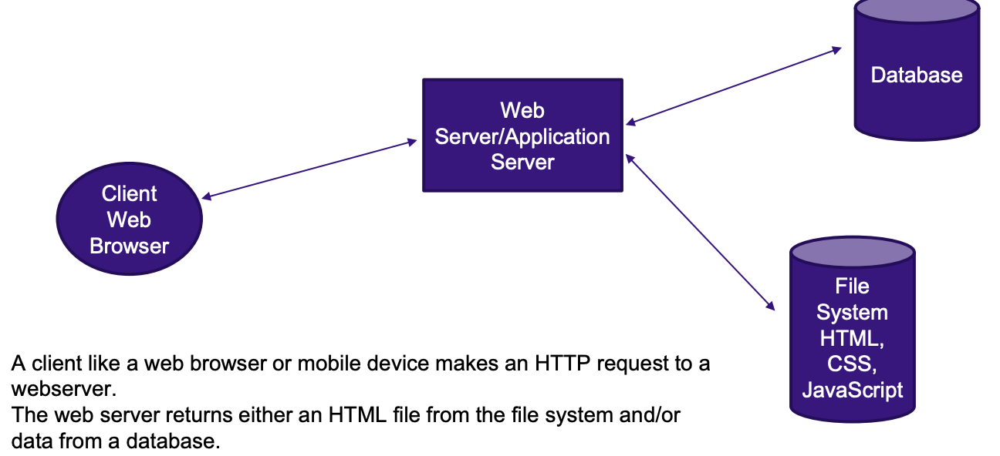

# CSC 2053 Web Exam Study Guide

## Web Introduction: chapters 1 and 2 slides

- Briefly describe a packet switched network. What advantage does a decentralized network like a packet switch network have over a centralized one like a circuit switch network?

  - Unlike a circuit switch network, a packet switch network does not require a continuous connection between the caller and the receiver. Instead, the original message is broken into numbered packets, each packet can travel via a different route, and the original message is reassembled from the packets at the receiver.

- Draw a diagram of the client server model including the browser, webserver, file system and database. Show an HTTP request from the client to the server, what's returned and the steps that are taken.

  - 

- What is an internet protocol?

  - A protocal is a set of rules that computers use when they communicate.

- Briefly define HTTP, FTP, POP, DNS protocols.

  - HTTP: Hypertext Transfer Protocol - used for web communication
  - FTP: File Transfer Protocol - used for transferring files between computers
  - POP/IMAP/SMTP: email-related protocols for transferring and storing email
  - DNS: Domain Name System - used for resolving domain names to IP addresses

- What role does DNS play in an HTTP request? Briefly describe the process.

  - The user types in a domain name into the browser and the DNS server resolves the domain name to an IP address. The browser then sends an HTTP request to the server at the IP address.

- What are the main features of the WWW defined by Tim Berners-Lee in 1992?

  - HTTP: Hypertext Transfer Protocol - to describe how requests and responses operate
  - URL: Uniform Resource Locator - to uniquely identify a resource on the WWW
  - Web server software: can respond to HTTP requests
  - Browser: can mamke HTTP requests to URLs and display the HTML
  - HTML: Hypertext Markup Language - to publish documents

- A web servers main job is to listen for and respond to requests. Given the following 2 URLS, write
  the port number the web server is listening on:

  - http://example.com
    - Port: 80
  - http://localhost:3000
    - Port: 3000

- What is the actual two line HTTP request text sent by a browser to a webserver for http://www.example.com

  ```
  GET /index.html HTTP/1.1
  Host: www.example.com
  ```

- What does it mean If the first line of the HTTP response from the webserver is `HTTP/1.1 200 ОК`?

  - That code represents a successful retrieval of the document ("OK")

- Assume the root of a webserver is /users/villanova/html and a request for a page to that webserver comes in like this, http://www.villanova.com/basketball/bigeast.html Where does the file bigeast.html reside on the file system?

  - /users/villanova/html/basketball/bigeast.html

- When a request for an HTML page is made, does the browser or the web server render the HTML?

  - The web server sends the HTML to the browser, and the browser renders the HTML.

## HTML slides

- Is HTML a programming language?

  - No, HTML is a markup language.

- What is an attribute within an HTML element? Give an example of an HTML attribute.

  - An HTML attribute is a name=value pair that provides more information about the element. For example, the `href` attribute in an anchor tag.

- Given this HTML, what is the parent element?

  ```html
  <div>
    <h1>Hello World!</h1>
    <p>I love web development!</p>
  </div>
  ```

  - The parent element is the `div` tag.

- What are some reasons not to use HTML to style a page?

  - HTML is not designed to style a page, it is designed to structure the content of a page. It is better to use CSS to style a page.

- In which HTML element should imports of CSS and JavaScript files go?
  - The `head` tag
- Should links to pages within the same website use a relative or absolute URL?
  - Relative URL
- Using the anchor tag, <...> give an example of an absolute URL, and a relative URL used in our bootstrap_portfolio.
  - Absolute URL: `<a href="http://www.example.com">Example</a>`
  - Relative URL: `<a href="about.html">About</a>`

## CSS

- Describe what the following style rule will do:

  ```css
  p {
    color: red;
    font-size: 3em;
    font-family: "Courier New", Courier, monospace;
  }
  ```

  - This rule will make all paragraphs:
    - Have red text
    - Have a font size of 3em (3 times the size of the default font size)
    - Use the font family "Courier New", or if that is not available, "Courier", or if that is not available, a generic monospace font

- Write a class selector with a font size of 1em, and a background-color purple.
  ```css
  .purple {
    font-size: 1em;
    background-color: purple;
  }
  ```
- Write an id selector with font color red.

  ```css
  #red {
    color: red;
  }
  ```

- What is a CSS framework? What framework did we work with in class?

  - A CSS framework is a set of CSS classes or other software tools that make it easier to use wand work with CSS. We worked with Bootstrap in class.

## Web frameworks

- What is the difference between a web framework and a content management system?

  - Web frameworks (Bootstrap, React, Django, Flask) require programming knowledge and allows for more customization
  - Content management systems (WordPress, Wix) do not require programming knowledge

- What is the difference between a front-end and a back-end framework? What tasks does each help with?

  - The front end (Bootstrap, React, Angular) is the part of the websiste that is visible to the user
  - The back end (Django, Ruby on Rails, Flask) is the part of the website that is not visible to the user and handles database management and server-side logic

- Are Bootstrap classes defined already and ready to use or do we have to create our own Bootstrap classes?

  - Bootstrap classes are defined already and ready to use

- Use the Bootstrap grid system to layout these two HTML image tags next to each other. They should each take up half the page.
  ``
  ``

  ```html
  <div class="row mt-3">
    <div class="col mt-3"></div>
    <div class="col mt-3"></div>
  </div>
  ```

## JavaScript

- What does it mean that JavaScript is a client side scripting language?
  - JavaScript is executed on the client's computer, not the server

- What are the advantages of client side scripting?
  - Proessing can be off-loaded from the server to client machines, thereby reducing the load on the server.
  - The browser can respond more rapidly to user events.
  - JS can interact with the downloaded HTML in a way that the server cannot, creating a user experience similar to that of a desktop software.

- In one line of code, using array destructuring, to store the first three elements of the following array in the variables: one, two, three. 
  ```JavaScript
  const [one, two, three] = ["apple", "banana", "cherry", "date"];
  ```


  ```JavaScript
  function two() { 
    x=2; 
  } 
  ```

  ```JavaScript
  const vals = [1,two,3,4,5] 
  ```

- Give a code example of a nested function in JavaScript. 
  ```
  function outerFunction() {
    console.log("Outer function executing.");

    // Nested function
    function innerFunction() {
        console.log("Inner function executing.");
    }

    // Call the nested function
    innerFunction();
  }

  // Call the outer function
  outerFunction();
  ```

- Consider these two functions. 

  ```JavaScript
    function callback() { 
      console.log(“This is a callback function”); 
    }

    function first(aFunction) { 
        aFunction(); 
    } 
  ```
  - Write the line of code that will execute the function first, and use the function callback as the parameter sent to first. 

  ```JavaScript
  first(callback);
  ```

- Write the following function as the simplest possible arrow function: 
  ```JavaScript
    (function (a) { 
        return a + 100; 
    }); 
  ```

  ```JavaScript
  const arrowFunction = a => a + 100;
  ```

- Given the following JavaScript object: 
  ```JavaScript
  const country = { 
    name: “Canada”, 
    languages: [“English”, “French”], 
    capital: {name: “Ottawa”, 
    “location”: “Ontario” 
  } 
  ```
    - Use object destructuring to store each property in its own variable. 
    ```JavaScript
    const { name, languages, capital } = country;
    ```

    - Use dot notation to get the value of the name property.
    ```JavaScript
    const countryName = country.name;
    ```

## DOM

- What is stored in the DOM? 
  - HTML elements called nodes.

- What JavaScript object stores the DOM?
  - The DOM document object is the root JS object representing the entire HTML document.

- Use a selector method on the document object to retrieve the HTML element from the following code and store it in a variable called helloNode.
  ```HTML
  <h1 id=”header”>Hello World!</h1> 
  helloNode = //your code goes here 
  ```

  ```JavaScript
  const helloNode = document.getElementById("header");
  ```


